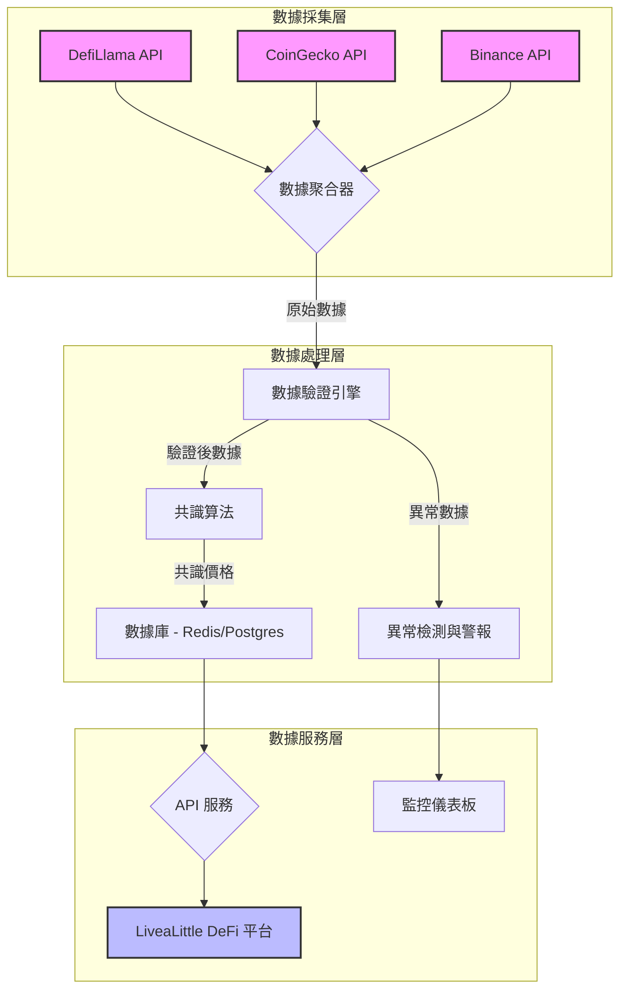

# LiveaLittle DeFi：多源數據聚合與驗證系統

**版本**: 1.0
**作者**: Manus AI

## 1. 系統概述

為了應對 DeFi 領域中數據準確性和可靠性的核心挑戰，我們設計並實現了一個先進的多源數據聚合與驗證系統。本系統是 LiveaLittle DeFi 平台數據基礎設施的基石，旨在提供一個準確、可靠且具有高可用性的實時市場數據源。

本系統通過從多個獨立的數據源（包括 DefiLlama、CoinGecko 和 Binance）並發獲取市場數據，並採用先進的驗證和共識算法，有效解決了「預言機問題」(Oracle Problem)，確保了平台所有策略和分析都基於最可信的數據。

## 2. 核心功能

- **多源數據聚合**：從多個頂級數據源並發獲取價格數據。
- **數據驗證引擎**：對每個數據點進行時間戳、價格範圍和完整性驗證。
- **共識算法**：使用 IQR 異常值檢測和中位數計算，生成單一的、可信的共識價格。
- **異常檢測與警報**：實時監控數據源延遲、價格劇烈波動、數據源分歧和系統性故障。
- **數據質量監控**：量化數據質量，提供新鮮度、可用性和一致性等多維度指標。

## 3. 系統架構

本系統採用分層架構，確保模塊化、可擴展性和易於維護。詳細的架構設計請參閱 `data_aggregator_architecture.md`。



## 4. 實施細節

### 4.1. 多源數據聚合器 (`multi_source_data_aggregator.py`)

這是系統的核心實現，包含以下關鍵組件：

- **DataSource (數據源)**：定義了數據源的基類，並為 CoinGecko, DefiLlama, Binance 提供了具體實現。
- **DataValidator (數據驗證器)**：負責驗證每個數據點的有效性。
- **ConsensusEngine (共識引擎)**：實現了基於 IQR 和中位數的共識算法。
- **MultiSourceAggregator (聚合器)**：協調所有組件，提供獲取共識價格的統一接口。

### 4.2. 數據質量監控 (`data_quality_monitor.py`)

該模塊負責實時監控數據質量和檢測異常情況：

- **AnomalyDetector (異常檢測器)**：實現了四種關鍵的異常檢測機制。
- **DataQualityCalculator (數據質量計算器)**：計算數據質量指標 (DQI)。
- **DataQualityMonitor (監控器)**：整合檢測和計算，生成完整的數據質量報告。

## 5. 如何使用

### 5.1. 獲取共識價格

```python
import asyncio
from multi_source_data_aggregator import MultiSourceAggregator

async def get_price(token: str):
    aggregator = MultiSourceAggregator()
    consensus = await aggregator.get_consensus_price(token)
    
    if consensus:
        print(f"Consensus price for {token}: ${consensus['price']:.2f}")
    else:
        print(f"Failed to get consensus price for {token}")

# 運行
asyncio.run(get_price("ETH"))
```

### 5.2. 監控數據質量

```python
import asyncio
from multi_source_data_aggregator import MultiSourceAggregator
from data_quality_monitor import DataQualityMonitor

async def check_quality(token: str):
    aggregator = MultiSourceAggregator()
    monitor = DataQualityMonitor()
    
    # 獲取數據
    datapoints = await aggregator.fetch_all_sources(token)
    for dp in datapoints:
        aggregator.validator.validate_datapoint(dp)
    
    consensus = aggregator.consensus_engine.calculate_consensus(datapoints)
    
    if consensus:
        # 生成質量報告
        report = monitor.monitor_consensus(
            token, consensus, datapoints, aggregator.sources
        )
        
        print(f"Overall quality for {token}: {report['quality_metrics']['overall_quality']:.3f}")
        monitor.save_report(report)

# 運行
asyncio.run(check_quality("ETH"))
```

## 6. 數據質量指標 (DQI)

為了提供透明和可信的數據，我們定義了以下數據質量指標：

| 指標 | 計算方法 | 描述 |
| :--- | :--- | :--- |
| **新鮮度 (Freshness)** | `1 - (age / 60)` | 數據的時效性，60 秒內為滿分 |
| **可用性 (Availability)** | `available / total` | 可用數據源的比例 |
| **一致性 (Consistency)** | `1 - (std_dev / price) / 0.01` | 數據點之間的一致性，標準差越小越好 |
| **總體質量 (Overall)** | 加權平均 | 三個指標的加權平均值 |

## 7. 異常檢測與警報

系統能夠自動檢測以下四種異常情況並觸發警報：

| 檢測類型 | 觸發條件 | 嚴重性 |
| :--- | :--- | :--- |
| **數據源延遲** | 超過 2 分鐘未更新 | Warning / Critical |
| **價格劇烈波動** | 1 分鐘內變化 > 10% | Warning / Critical |
| **數據源分歧** | >1/3 數據源偏差 > 5% | Warning |
| **系統性故障** | >2/3 數據源失效 | Critical |

## 8. 部署與集成

本系統已作為 LiveaLittle DeFi 後端服務的一部分進行集成。數據聚合器將作為一個獨立的微服務運行，定時將共識價格推送到 Redis 緩存中，供主 API 服務器使用。數據質量報告和警報將被寫入 PostgreSQL 數據庫，並在監控儀表板上顯示。

## 9. 結論

通過這個強大的多源數據聚合與驗證系統，LiveaLittle DeFi 平台確保了其所有數據驅動決策的基礎都是穩固和可靠的。這不僅提升了平台的安全性，也極大地增強了用戶對我們產品的信任。

---

## 附錄：相關文件

- `data_aggregator_architecture.md`：詳細的系統架構設計文檔。
- `multi_source_data_aggregator.py`：數據聚合器的完整 Python 實現代碼。
- `data_quality_monitor.py`：數據質量監控和異常檢測的實現代碼。

