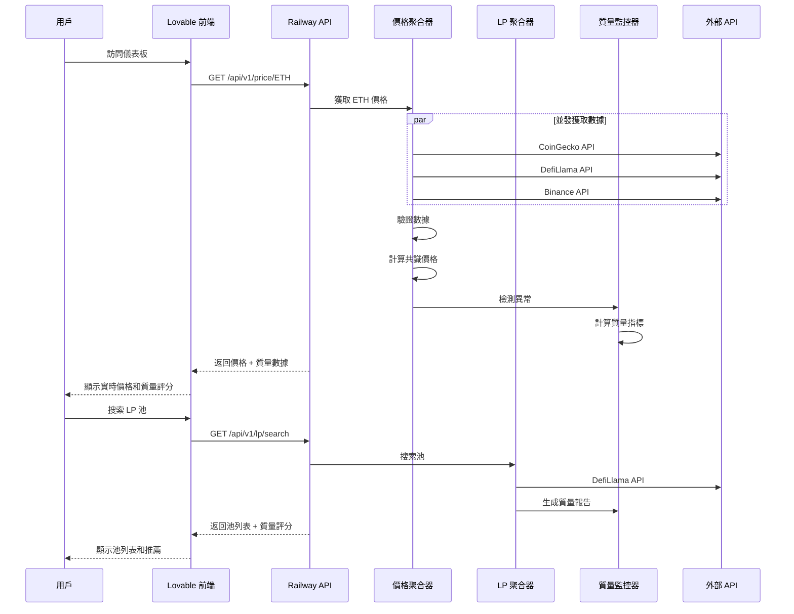

# LiveaLittle DeFi：Lovable 完整集成操作指南

**版本**: 2.0 (包含數據聚合與驗證系統)
**作者**: Manus AI
**更新日期**: 2025-10-15

---

## 📋 目錄

1. [系統概述](#1-系統概述)
2. [前置準備](#2-前置準備)
3. [後端部署](#3-後端部署)
4. [Lovable 前端開發](#4-lovable-前端開發)
5. [數據流程整合](#5-數據流程整合)
6. [測試與驗證](#6-測試與驗證)
7. [監控與維護](#7-監控與維護)
8. [故障排除](#8-故障排除)

---

## 1. 系統概述

LiveaLittle DeFi 是一個完整的 DeFi 投資平台，包含以下核心系統：

### 1.1. 後端系統

**多源價格數據聚合器** (`multi_source_data_aggregator.py`)
- 從 CoinGecko、DefiLlama、Binance 獲取代幣價格
- 使用 IQR 異常值檢測和中位數共識算法
- 提供數據質量指標 (DQI)

**LP Pair 數據聚合器** (`lp_pair_data_aggregator.py`)
- 從 DefiLlama、Uniswap V3、GeckoTerminal 獲取流動性池數據
- 智能池搜索和過濾
- TVL、APY、交易量數據驗證

**數據質量監控系統** (`data_quality_monitor.py` + `lp_data_quality_monitor.py`)
- 實時異常檢測（價格波動、TVL 下降、APY 異常等）
- 質量評分和投資建議
- 警報系統

**Davis Double-Click 分析器** (`davis_double_click_analyzer.py`)
- 市場狀態識別
- 趨勢強度計算
- 進場/出場信號生成

**Delta Neutral 引擎** (`delta_neutral_engine.py`)
- 自動對沖計算
- 風險管理
- 再平衡策略

### 1.2. 前端系統 (Lovable)

**儀表板頁面**：顯示投資組合總覽、市場狀態、數據質量指標

**市場分析頁面**：實時價格圖表、Davis Double-Click 信號、市場趨勢

**LP 池管理頁面**：池搜索、質量評分、投資建議

**策略配置頁面**：Delta Neutral 策略設置、風險參數調整

**監控頁面**：數據質量監控、異常警報、系統狀態

---

## 2. 前置準備

### 2.1. 所需賬號

| 服務 | 用途 | 註冊鏈接 |
| :--- | :--- | :--- |
| **Lovable** | 前端開發平台 | https://lovable.dev |
| **Railway** | 後端部署 | https://railway.app |
| **Supabase** | 數據庫（可選） | https://supabase.com |
| **GitHub** | 代碼託管 | https://github.com |

### 2.2. 本地環境準備

```bash
# 安裝 Python 依賴
pip3 install aiohttp fastapi uvicorn apscheduler redis psycopg2-binary

# 驗證安裝
python3 -c "import aiohttp, fastapi; print('Dependencies OK')"
```

### 2.3. 文件清單

確保您有以下文件：

```
defi_system/
├── backend/
│   ├── multi_source_data_aggregator.py      # 價格數據聚合器
│   ├── lp_pair_data_aggregator.py           # LP 數據聚合器
│   ├── data_quality_monitor.py              # 價格數據質量監控
│   ├── lp_data_quality_monitor.py           # LP 數據質量監控
│   ├── davis_double_click_analyzer.py       # Davis 分析器
│   ├── delta_neutral_engine.py              # Delta Neutral 引擎
│   └── api_server.py                        # FastAPI 服務器
├── LOVABLE_COMPLETE_INTEGRATION_GUIDE.md    # 本文檔
└── API_DOCUMENTATION_INDEX.md               # API 文檔索引
```

---

## 3. 後端部署

### 3.1. 創建統一 API 服務器

創建 `backend/unified_api_server.py`：

```python
"""
LiveaLittle DeFi 統一 API 服務器
整合所有數據聚合和分析功能
"""

from fastapi import FastAPI, HTTPException
from fastapi.middleware.cors import CORSMiddleware
import asyncio
from typing import List, Optional
import logging

# 導入所有模塊
from multi_source_data_aggregator import MultiSourceAggregator
from lp_pair_data_aggregator import LPPairDataAggregator
from data_quality_monitor import DataQualityMonitor
from lp_data_quality_monitor import LPDataQualityMonitor

logging.basicConfig(level=logging.INFO)
logger = logging.getLogger(__name__)

app = FastAPI(title="LiveaLittle DeFi API", version="2.0")

# CORS 設置
app.add_middleware(
    CORSMiddleware,
    allow_origins=["*"],  # 生產環境應該限制具體域名
    allow_credentials=True,
    allow_methods=["*"],
    allow_headers=["*"],
)

# 初始化聚合器和監控器
price_aggregator = MultiSourceAggregator()
lp_aggregator = LPPairDataAggregator()
price_monitor = DataQualityMonitor()
lp_monitor = LPDataQualityMonitor()

# 價格數據緩存
price_cache = {}
lp_cache = {}


@app.get("/")
async def root():
    """API 根路徑"""
    return {
        "name": "LiveaLittle DeFi API",
        "version": "2.0",
        "status": "operational",
        "endpoints": {
            "price": "/api/v1/price/{token}",
            "prices": "/api/v1/prices",
            "lp_pools": "/api/v1/lp/search",
            "lp_pool": "/api/v1/lp/pool/{pool_id}",
            "data_quality": "/api/v1/quality/status",
            "health": "/health"
        }
    }


@app.get("/health")
async def health_check():
    """健康檢查"""
    return {
        "status": "healthy",
        "price_aggregator": "operational",
        "lp_aggregator": "operational"
    }


# ==================== 價格數據 API ====================

@app.get("/api/v1/price/{token}")
async def get_token_price(token: str):
    """獲取單個代幣的共識價格"""
    try:
        token = token.upper()
        
        # 檢查緩存
        if token in price_cache:
            cached_data = price_cache[token]
            # 如果緩存數據不超過 30 秒，直接返回
            import time
            if time.time() - cached_data.get("timestamp", 0) < 30:
                return cached_data
        
        # 獲取新數據
        consensus = await price_aggregator.get_consensus_price(token)
        
        if not consensus:
            raise HTTPException(status_code=503, detail=f"Failed to get price for {token}")
        
        # 計算數據質量
        metrics = price_aggregator.get_data_quality_metrics()
        
        result = {
            "token": token,
            "price": consensus["price"],
            "sources": consensus["sources"],
            "data_points": consensus["data_points"],
            "std_dev": consensus["std_dev"],
            "timestamp": consensus["timestamp"],
            "data_quality": {
                "source_availability": metrics["source_availability"],
                "available_sources": metrics["available_sources"]
            }
        }
        
        # 更新緩存
        price_cache[token] = result
        
        return result
        
    except Exception as e:
        logger.error(f"Error getting price for {token}: {e}")
        raise HTTPException(status_code=500, detail=str(e))


@app.post("/api/v1/prices")
async def get_multiple_prices(tokens: List[str]):
    """批量獲取多個代幣價格"""
    try:
        results = {}
        
        for token in tokens:
            token = token.upper()
            consensus = await price_aggregator.get_consensus_price(token)
            
            if consensus:
                results[token] = {
                    "price": consensus["price"],
                    "sources": consensus["sources"],
                    "timestamp": consensus["timestamp"]
                }
        
        return results
        
    except Exception as e:
        logger.error(f"Error getting multiple prices: {e}")
        raise HTTPException(status_code=500, detail=str(e))


# ==================== LP Pool 數據 API ====================

@app.get("/api/v1/lp/search")
async def search_lp_pools(
    token0: Optional[str] = None,
    token1: Optional[str] = None,
    protocol: Optional[str] = None,
    chain: Optional[str] = None,
    min_tvl: float = 1000000,
    min_apy: float = 5.0,
    limit: int = 10
):
    """搜索 LP 池"""
    try:
        pools = await lp_aggregator.search_best_pools(
            token0=token0,
            token1=token1,
            protocol=protocol,
            chain=chain,
            min_tvl=min_tvl,
            min_apy=min_apy,
            limit=limit
        )
        
        # 為每個池生成質量報告
        enhanced_pools = []
        for pool in pools:
            # 構建完整的池數據
            pool_data = {
                "pool_address": pool["pool_address"],
                "protocol": pool["protocol"],
                "chain": pool["chain"],
                "token0": pool["pair"].split("/")[0],
                "token1": pool["pair"].split("/")[1],
                "tvl": pool["tvl"],
                "apy": pool["apy"],
                "volume_24h": pool["volume_24h"]
            }
            
            # 生成質量報告
            report = lp_monitor.monitor_pool(pool_data)
            recommendation = lp_monitor.get_pool_recommendation(report)
            
            enhanced_pool = {
                **pool,
                "quality_scores": report["quality_scores"],
                "recommendation": recommendation
            }
            
            enhanced_pools.append(enhanced_pool)
        
        return {
            "total": len(enhanced_pools),
            "pools": enhanced_pools
        }
        
    except Exception as e:
        logger.error(f"Error searching LP pools: {e}")
        raise HTTPException(status_code=500, detail=str(e))


@app.get("/api/v1/lp/pool/{pool_id}")
async def get_lp_pool_details(pool_id: str, chain: str = "ethereum"):
    """獲取特定 LP 池的詳細信息"""
    try:
        # 檢查緩存
        cache_key = f"{pool_id}_{chain}"
        if cache_key in lp_cache:
            cached_data = lp_cache[cache_key]
            import time
            if time.time() - cached_data.get("timestamp", 0) < 300:  # 5 分鐘緩存
                return cached_data
        
        # 獲取池數據
        consensus = await lp_aggregator.get_consensus_pool_data(
            pool_id=pool_id,
            chain=chain
        )
        
        if not consensus:
            raise HTTPException(status_code=404, detail=f"Pool {pool_id} not found")
        
        # 生成質量報告
        report = lp_monitor.monitor_pool(consensus)
        recommendation = lp_monitor.get_pool_recommendation(report)
        
        result = {
            **consensus,
            "quality_report": report,
            "recommendation": recommendation
        }
        
        # 更新緩存
        lp_cache[cache_key] = result
        
        return result
        
    except HTTPException:
        raise
    except Exception as e:
        logger.error(f"Error getting pool details for {pool_id}: {e}")
        raise HTTPException(status_code=500, detail=str(e))


# ==================== 數據質量監控 API ====================

@app.get("/api/v1/quality/status")
async def get_data_quality_status():
    """獲取整體數據質量狀態"""
    try:
        # 價格數據質量
        price_metrics = price_aggregator.get_data_quality_metrics()
        price_status = price_monitor.get_status_summary()
        
        # LP 數據質量
        lp_alerts = lp_monitor.anomaly_detector.get_recent_alerts(seconds=300)
        
        return {
            "overall_status": price_status["status"],
            "price_data": {
                "source_availability": price_metrics["source_availability"],
                "available_sources": price_metrics["available_sources"],
                "total_sources": price_metrics["total_sources"],
                "alerts": {
                    "total": price_status["total_alerts"],
                    "critical": price_status["critical_alerts"],
                    "warning": price_status["warning_alerts"]
                }
            },
            "lp_data": {
                "recent_alerts": len(lp_alerts),
                "alert_types": list(set([a["type"] for a in lp_alerts]))
            },
            "timestamp": int(asyncio.get_event_loop().time())
        }
        
    except Exception as e:
        logger.error(f"Error getting data quality status: {e}")
        raise HTTPException(status_code=500, detail=str(e))


@app.get("/api/v1/quality/alerts")
async def get_recent_alerts(seconds: int = 300):
    """獲取最近的警報"""
    try:
        price_alerts = price_monitor.anomaly_detector.get_recent_alerts(seconds)
        lp_alerts = lp_monitor.anomaly_detector.get_recent_alerts(seconds)
        
        return {
            "price_alerts": price_alerts,
            "lp_alerts": lp_alerts,
            "total": len(price_alerts) + len(lp_alerts)
        }
        
    except Exception as e:
        logger.error(f"Error getting alerts: {e}")
        raise HTTPException(status_code=500, detail=str(e))


# ==================== 定時任務 ====================

async def update_price_cache():
    """定時更新價格緩存"""
    tokens = ["BTC", "ETH", "USDC", "USDT", "DAI"]
    
    while True:
        try:
            for token in tokens:
                consensus = await price_aggregator.get_consensus_price(token)
                if consensus:
                    price_cache[token] = {
                        "token": token,
                        "price": consensus["price"],
                        "sources": consensus["sources"],
                        "timestamp": consensus["timestamp"]
                    }
            
            logger.info(f"Price cache updated for {len(tokens)} tokens")
            
        except Exception as e:
            logger.error(f"Error updating price cache: {e}")
        
        await asyncio.sleep(30)  # 每 30 秒更新一次


@app.on_event("startup")
async def startup_event():
    """啟動時執行"""
    logger.info("Starting LiveaLittle DeFi API Server...")
    
    # 啟動定時任務
    asyncio.create_task(update_price_cache())
    
    logger.info("API Server started successfully!")


if __name__ == "__main__":
    import uvicorn
    uvicorn.run(app, host="0.0.0.0", port=8000)
```

### 3.2. 在 Railway 上部署

#### 步驟 1：準備部署文件

創建 `requirements.txt`：

```txt
fastapi==0.104.1
uvicorn[standard]==0.24.0
aiohttp==3.9.1
apscheduler==3.10.4
redis==5.0.1
psycopg2-binary==2.9.9
```

創建 `Procfile`：

```
web: uvicorn backend.unified_api_server:app --host 0.0.0.0 --port $PORT
```

創建 `railway.json`：

```json
{
  "$schema": "https://railway.app/railway.schema.json",
  "build": {
    "builder": "NIXPACKS"
  },
  "deploy": {
    "startCommand": "uvicorn backend.unified_api_server:app --host 0.0.0.0 --port $PORT",
    "restartPolicyType": "ON_FAILURE",
    "restartPolicyMaxRetries": 10
  }
}
```

#### 步驟 2：推送到 GitHub

```bash
cd /home/ubuntu/defi_system
git init
git add .
git commit -m "Initial commit: LiveaLittle DeFi backend"
git branch -M main
git remote add origin https://github.com/YOUR_USERNAME/livealittle-defi.git
git push -u origin main
```

#### 步驟 3：在 Railway 部署

1. 訪問 https://railway.app
2. 點擊 "New Project" → "Deploy from GitHub repo"
3. 選擇您的 `livealittle-defi` 倉庫
4. Railway 會自動檢測並部署
5. 部署完成後，點擊 "Generate Domain" 獲取 API URL

**您的 API URL 示例**：`https://livealittle-defi-production.up.railway.app`

---

## 4. Lovable 前端開發

### 4.1. 創建 Lovable 項目

1. 訪問 https://lovable.dev
2. 點擊 "New Project"
3. 選擇 "Blank Template"
4. 項目名稱：`LiveaLittle DeFi`

### 4.2. 配置 API 連接

在 Lovable 中創建 `src/config/api.ts`：

```typescript
// API 配置
export const API_CONFIG = {
  BASE_URL: 'https://your-railway-app.up.railway.app',
  ENDPOINTS: {
    PRICE: '/api/v1/price',
    PRICES: '/api/v1/prices',
    LP_SEARCH: '/api/v1/lp/search',
    LP_POOL: '/api/v1/lp/pool',
    QUALITY_STATUS: '/api/v1/quality/status',
    QUALITY_ALERTS: '/api/v1/quality/alerts',
  },
  TIMEOUT: 10000,
};

// API 客戶端
export class APIClient {
  private baseURL: string;

  constructor(baseURL: string = API_CONFIG.BASE_URL) {
    this.baseURL = baseURL;
  }

  async get(endpoint: string, params?: Record<string, any>) {
    const url = new URL(`${this.baseURL}${endpoint}`);
    
    if (params) {
      Object.keys(params).forEach(key => 
        url.searchParams.append(key, params[key])
      );
    }

    const response = await fetch(url.toString(), {
      method: 'GET',
      headers: {
        'Content-Type': 'application/json',
      },
    });

    if (!response.ok) {
      throw new Error(`API Error: ${response.statusText}`);
    }

    return response.json();
  }

  async post(endpoint: string, data: any) {
    const response = await fetch(`${this.baseURL}${endpoint}`, {
      method: 'POST',
      headers: {
        'Content-Type': 'application/json',
      },
      body: JSON.stringify(data),
    });

    if (!response.ok) {
      throw new Error(`API Error: ${response.statusText}`);
    }

    return response.json();
  }
}

export const apiClient = new APIClient();
```

### 4.3. 創建數據服務層

創建 `src/services/priceService.ts`：

```typescript
import { apiClient, API_CONFIG } from '@/config/api';

export interface TokenPrice {
  token: string;
  price: number;
  sources: string[];
  data_points: number;
  std_dev: number;
  timestamp: number;
  data_quality: {
    source_availability: number;
    available_sources: number;
  };
}

export class PriceService {
  async getTokenPrice(token: string): Promise<TokenPrice> {
    return apiClient.get(`${API_CONFIG.ENDPOINTS.PRICE}/${token}`);
  }

  async getMultiplePrices(tokens: string[]): Promise<Record<string, any>> {
    return apiClient.post(API_CONFIG.ENDPOINTS.PRICES, tokens);
  }
}

export const priceService = new PriceService();
```

創建 `src/services/lpService.ts`：

```typescript
import { apiClient, API_CONFIG } from '@/config/api';

export interface LPPool {
  pool_address: string;
  protocol: string;
  chain: string;
  pair: string;
  tvl: number;
  apy: number;
  volume_24h: number;
  quality_scores: {
    completeness: number;
    consistency: number;
    liquidity: number;
    risk: number;
  };
  recommendation: string;
}

export interface LPSearchParams {
  token0?: string;
  token1?: string;
  protocol?: string;
  chain?: string;
  min_tvl?: number;
  min_apy?: number;
  limit?: number;
}

export class LPService {
  async searchPools(params: LPSearchParams): Promise<{ total: number; pools: LPPool[] }> {
    return apiClient.get(API_CONFIG.ENDPOINTS.LP_SEARCH, params);
  }

  async getPoolDetails(poolId: string, chain: string = 'ethereum'): Promise<any> {
    return apiClient.get(`${API_CONFIG.ENDPOINTS.LP_POOL}/${poolId}`, { chain });
  }
}

export const lpService = new LPService();
```

創建 `src/services/qualityService.ts`：

```typescript
import { apiClient, API_CONFIG } from '@/config/api';

export interface DataQualityStatus {
  overall_status: string;
  price_data: {
    source_availability: number;
    available_sources: number;
    total_sources: number;
    alerts: {
      total: number;
      critical: number;
      warning: number;
    };
  };
  lp_data: {
    recent_alerts: number;
    alert_types: string[];
  };
  timestamp: number;
}

export class QualityService {
  async getStatus(): Promise<DataQualityStatus> {
    return apiClient.get(API_CONFIG.ENDPOINTS.QUALITY_STATUS);
  }

  async getAlerts(seconds: number = 300): Promise<any> {
    return apiClient.get(API_CONFIG.ENDPOINTS.QUALITY_ALERTS, { seconds });
  }
}

export const qualityService = new QualityService();
```

### 4.4. 使用 Lovable AI 創建頁面

現在，您可以使用 Lovable 的 AI 助手來創建頁面。以下是提示詞範例：

#### 提示詞 1：創建儀表板頁面

```
創建一個 DeFi 儀表板頁面，包含以下組件：

1. 頂部狀態卡片區域：
   - 顯示投資組合總價值
   - 顯示今日收益（百分比和金額）
   - 顯示數據質量狀態（使用 qualityService.getStatus()）
   - 使用綠色/黃色/紅色指示器顯示系統健康狀態

2. 實時價格區域：
   - 顯示 BTC、ETH、USDC 的實時價格
   - 使用 priceService.getTokenPrice() 獲取數據
   - 每 30 秒自動刷新
   - 顯示數據來源數量和質量評分

3. 市場狀態區域：
   - 顯示當前市場狀態（牛市/熊市/橫盤）
   - 顯示 Davis Double-Click 信號
   - 使用圖表顯示趨勢

4. 快速操作區域：
   - "搜索 LP 池" 按鈕
   - "查看警報" 按鈕
   - "配置策略" 按鈕

使用 shadcn/ui 組件，採用現代化設計，響應式布局。
```

#### 提示詞 2：創建 LP 池搜索頁面

```
創建一個 LP 池搜索和管理頁面，包含以下功能：

1. 搜索表單：
   - Token 0 輸入框
   - Token 1 輸入框
   - 協議選擇（Uniswap V3, Curve, Balancer）
   - 鏈選擇（Ethereum, Arbitrum, Polygon）
   - 最小 TVL 滑塊（範圍：$100K - $100M）
   - 最小 APY 滑塊（範圍：0% - 50%）
   - "搜索" 按鈕

2. 結果表格：
   - 顯示池地址、協議、鏈、代幣對
   - 顯示 TVL、APY、24h 交易量
   - 顯示質量評分（完整性、一致性、流動性、風險）
   - 顯示推薦等級（EXCELLENT/GOOD/FAIR/POOR）
   - 使用顏色編碼（綠色=EXCELLENT，黃色=GOOD，橙色=FAIR，紅色=POOR）
   - 每行有 "查看詳情" 按鈕

3. 池詳情模態框：
   - 點擊 "查看詳情" 時彈出
   - 顯示完整的池信息
   - 顯示質量報告
   - 顯示歷史數據圖表
   - "添加到投資組合" 按鈕

使用 lpService.searchPools() 獲取數據。
使用 shadcn/ui 的 Table, Dialog, Slider 組件。
```

#### 提示詞 3：創建數據質量監控頁面

```
創建一個數據質量監控頁面，包含以下內容：

1. 整體狀態卡片：
   - 大型狀態指示器（HEALTHY/WARNING/CRITICAL）
   - 使用 qualityService.getStatus() 獲取數據
   - 顯示價格數據源可用性百分比
   - 顯示 LP 數據源可用性百分比

2. 數據源狀態表格：
   - 列出所有數據源（CoinGecko, DefiLlama, Binance, Uniswap V3, GeckoTerminal）
   - 顯示每個數據源的狀態（在線/離線）
   - 顯示最後更新時間
   - 顯示錯誤計數

3. 警報列表：
   - 使用 qualityService.getAlerts() 獲取最近 5 分鐘的警報
   - 按嚴重性排序（Critical > Warning > Info）
   - 顯示警報類型、時間、詳細信息
   - 使用圖標和顏色區分嚴重性

4. 實時圖表：
   - 顯示過去 1 小時的數據質量趨勢
   - 顯示警報數量趨勢

每 30 秒自動刷新數據。
使用 shadcn/ui 組件和 Recharts 圖表庫。
```

### 4.5. 創建自定義 Hooks

創建 `src/hooks/useTokenPrice.ts`：

```typescript
import { useState, useEffect } from 'react';
import { priceService, TokenPrice } from '@/services/priceService';

export function useTokenPrice(token: string, refreshInterval: number = 30000) {
  const [price, setPrice] = useState<TokenPrice | null>(null);
  const [loading, setLoading] = useState(true);
  const [error, setError] = useState<string | null>(null);

  useEffect(() => {
    const fetchPrice = async () => {
      try {
        setLoading(true);
        const data = await priceService.getTokenPrice(token);
        setPrice(data);
        setError(null);
      } catch (err) {
        setError(err instanceof Error ? err.message : 'Unknown error');
      } finally {
        setLoading(false);
      }
    };

    fetchPrice();
    const interval = setInterval(fetchPrice, refreshInterval);

    return () => clearInterval(interval);
  }, [token, refreshInterval]);

  return { price, loading, error };
}
```

創建 `src/hooks/useDataQuality.ts`：

```typescript
import { useState, useEffect } from 'react';
import { qualityService, DataQualityStatus } from '@/services/qualityService';

export function useDataQuality(refreshInterval: number = 30000) {
  const [status, setStatus] = useState<DataQualityStatus | null>(null);
  const [loading, setLoading] = useState(true);
  const [error, setError] = useState<string | null>(null);

  useEffect(() => {
    const fetchStatus = async () => {
      try {
        setLoading(true);
        const data = await qualityService.getStatus();
        setStatus(data);
        setError(null);
      } catch (err) {
        setError(err instanceof Error ? err.message : 'Unknown error');
      } finally {
        setLoading(false);
      }
    };

    fetchStatus();
    const interval = setInterval(fetchStatus, refreshInterval);

    return () => clearInterval(interval);
  }, [refreshInterval]);

  return { status, loading, error };
}
```

---

## 5. 數據流程整合

### 5.1. 完整數據流程圖



### 5.2. 錯誤處理流程

在 Lovable 中實現錯誤處理：

```typescript
// src/utils/errorHandler.ts
export class APIError extends Error {
  constructor(
    message: string,
    public statusCode?: number,
    public details?: any
  ) {
    super(message);
    this.name = 'APIError';
  }
}

export function handleAPIError(error: any): string {
  if (error instanceof APIError) {
    switch (error.statusCode) {
      case 404:
        return '資源未找到';
      case 503:
        return '服務暫時不可用，請稍後再試';
      case 500:
        return '服務器錯誤，請聯繫支持團隊';
      default:
        return error.message;
    }
  }
  
  if (error instanceof TypeError && error.message.includes('fetch')) {
    return '網絡連接失敗，請檢查您的網絡';
  }
  
  return '發生未知錯誤，請重試';
}
```

---

## 6. 測試與驗證

### 6.1. 後端 API 測試

使用 `curl` 測試 API：

```bash
# 測試健康檢查
curl https://your-railway-app.up.railway.app/health

# 測試價格 API
curl https://your-railway-app.up.railway.app/api/v1/price/ETH

# 測試 LP 搜索
curl "https://your-railway-app.up.railway.app/api/v1/lp/search?token0=ETH&token1=USDC&min_tvl=10000000"

# 測試數據質量
curl https://your-railway-app.up.railway.app/api/v1/quality/status
```

### 6.2. 前端功能測試清單

- [ ] 儀表板頁面正常加載
- [ ] 實時價格每 30 秒更新
- [ ] 數據質量指標正確顯示
- [ ] LP 池搜索功能正常
- [ ] 池詳情模態框正常彈出
- [ ] 質量評分顏色編碼正確
- [ ] 警報列表正常顯示
- [ ] 響應式布局在移動端正常

### 6.3. 性能測試

在 Lovable 中添加性能監控：

```typescript
// src/utils/performance.ts
export function measureAPIPerformance(apiName: string) {
  const startTime = performance.now();
  
  return {
    end: () => {
      const endTime = performance.now();
      const duration = endTime - startTime;
      console.log(`[Performance] ${apiName}: ${duration.toFixed(2)}ms`);
      
      if (duration > 3000) {
        console.warn(`[Performance] ${apiName} is slow (>${duration.toFixed(2)}ms)`);
      }
    }
  };
}

// 使用範例
const perf = measureAPIPerformance('getTokenPrice');
const price = await priceService.getTokenPrice('ETH');
perf.end();
```

---

## 7. 監控與維護

### 7.1. 設置日誌記錄

在後端添加結構化日誌：

```python
import logging
import json
from datetime import datetime

class StructuredLogger:
    def __init__(self, name: str):
        self.logger = logging.getLogger(name)
    
    def log_api_call(self, endpoint: str, status: str, duration: float):
        self.logger.info(json.dumps({
            "timestamp": datetime.utcnow().isoformat(),
            "type": "api_call",
            "endpoint": endpoint,
            "status": status,
            "duration_ms": duration
        }))
    
    def log_data_quality(self, metric: str, value: float):
        self.logger.info(json.dumps({
            "timestamp": datetime.utcnow().isoformat(),
            "type": "data_quality",
            "metric": metric,
            "value": value
        }))
```

### 7.2. 設置警報

在 Railway 中設置環境變量：

```bash
ALERT_WEBHOOK_URL=https://hooks.slack.com/services/YOUR/WEBHOOK/URL
```

在後端添加警報發送：

```python
import aiohttp

async def send_alert(message: str, severity: str = "warning"):
    """發送警報到 Slack"""
    webhook_url = os.getenv("ALERT_WEBHOOK_URL")
    if not webhook_url:
        return
    
    payload = {
        "text": f"[{severity.upper()}] {message}",
        "username": "LiveaLittle DeFi Bot"
    }
    
    async with aiohttp.ClientSession() as session:
        await session.post(webhook_url, json=payload)
```

### 7.3. 定期維護任務

創建 `maintenance.py`：

```python
"""
定期維護任務
"""

import asyncio
from datetime import datetime

async def cleanup_old_cache():
    """清理舊緩存"""
    # 實現緩存清理邏輯
    pass

async def check_data_sources():
    """檢查數據源健康"""
    # 實現數據源健康檢查
    pass

async def generate_daily_report():
    """生成每日報告"""
    # 實現報告生成邏輯
    pass

async def maintenance_loop():
    """維護循環"""
    while True:
        try:
            # 每小時清理緩存
            await cleanup_old_cache()
            
            # 每 10 分鐘檢查數據源
            await check_data_sources()
            
            # 每天生成報告
            now = datetime.now()
            if now.hour == 0 and now.minute < 10:
                await generate_daily_report()
            
        except Exception as e:
            logger.error(f"Maintenance error: {e}")
        
        await asyncio.sleep(600)  # 10 分鐘
```

---

## 8. 故障排除

### 8.1. 常見問題

**問題 1：API 返回 503 錯誤**

**原因**：數據源不可用或超時

**解決方案**：
```python
# 增加超時時間
async with session.get(url, timeout=aiohttp.ClientTimeout(total=30)) as response:
    pass

# 添加重試邏輯
for attempt in range(3):
    try:
        result = await fetch_data()
        break
    except Exception as e:
        if attempt == 2:
            raise
        await asyncio.sleep(2 ** attempt)
```

**問題 2：前端無法連接到 API**

**原因**：CORS 配置錯誤

**解決方案**：
```python
# 在 FastAPI 中正確配置 CORS
app.add_middleware(
    CORSMiddleware,
    allow_origins=["https://your-lovable-app.lovable.app"],
    allow_credentials=True,
    allow_methods=["*"],
    allow_headers=["*"],
)
```

**問題 3：數據質量評分異常**

**原因**：數據源返回異常值

**解決方案**：
```python
# 加強數據驗證
def validate_pool_data(pool: LPPoolData) -> bool:
    # 添加更嚴格的驗證規則
    if pool.tvl < 0 or pool.tvl > 10_000_000_000:  # 100 億美元上限
        return False
    
    if pool.apy < -100 or pool.apy > 10000:
        return False
    
    return True
```

### 8.2. 調試技巧

**啟用詳細日誌**：

```python
# 在 Railway 環境變量中設置
LOG_LEVEL=DEBUG

# 在代碼中使用
logging.basicConfig(
    level=os.getenv("LOG_LEVEL", "INFO"),
    format='%(asctime)s - %(name)s - %(levelname)s - %(message)s'
)
```

**使用 Railway 日誌查看器**：

1. 進入 Railway 項目
2. 點擊 "Deployments"
3. 選擇最新部署
4. 點擊 "View Logs"

**在 Lovable 中調試**：

```typescript
// 啟用詳細控制台輸出
if (process.env.NODE_ENV === 'development') {
  console.log('[API Call]', endpoint, params);
  console.log('[API Response]', response);
}
```

---

## 9. 總結

恭喜！您現在已經擁有一個完整的 LiveaLittle DeFi 系統集成指南。

### 9.1. 系統架構總覽

**後端（Railway）**：
- 多源價格數據聚合器
- LP Pair 數據聚合器
- 數據質量監控系統
- 統一 FastAPI 服務器

**前端（Lovable）**：
- 儀表板頁面
- LP 池搜索頁面
- 數據質量監控頁面
- 策略配置頁面

**數據流**：外部 API → 聚合器 → 驗證 → 共識 → 質量監控 → API → Lovable → 用戶

### 9.2. 下一步行動

1. **立即部署**：按照本指南部署後端到 Railway
2. **創建前端**：使用 Lovable AI 和提示詞創建頁面
3. **測試驗證**：完成所有測試清單項目
4. **監控優化**：設置日誌和警報系統
5. **持續改進**：根據用戶反饋迭代功能

### 9.3. 相關文檔

- `API_DOCUMENTATION_INDEX.md`：API 文檔索引
- `DATA_AGGREGATION_AND_VALIDATION_SYSTEM.md`：數據聚合系統文檔
- `LP_DATA_AGGREGATION_SYSTEM.md`：LP 數據聚合系統文檔
- `API_DEPLOYMENT_GUIDE.md`：部署指南

---

**祝您開發順利！如有問題，請參考故障排除章節或查閱相關文檔。**

