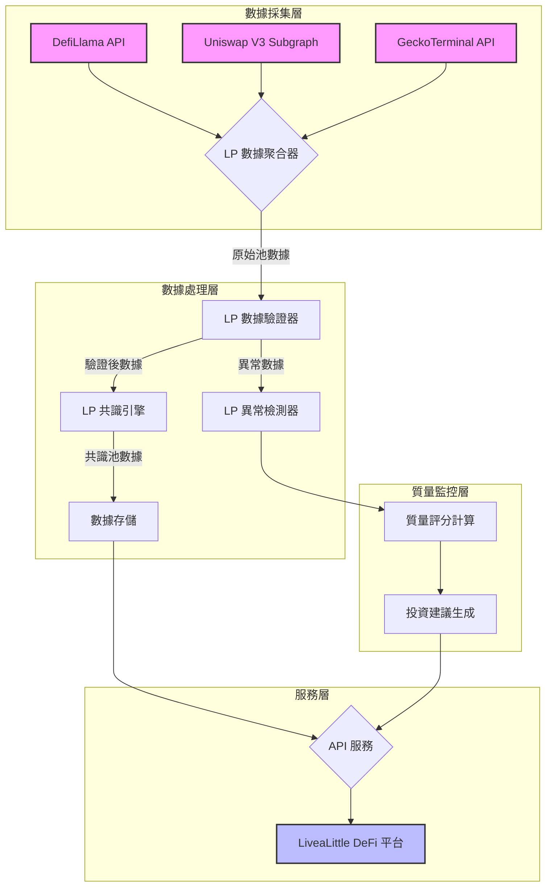

# LiveaLittle DeFi：LP Pair 數據聚合與驗證系統

**版本**: 1.0
**作者**: Manus AI

## 1. 系統概述

流動性池 (Liquidity Pool, LP) 數據是 DeFi 系統的核心，尤其對於 Delta Neutral 策略而言更是至關重要。本系統專門設計用於從多個數據源聚合、驗證和監控 LP pair 數據，確保 LiveaLittle DeFi 平台能夠基於最準確和最新的流動性池信息做出投資決策。

本系統不僅提供實時的 TVL、APY 和交易量數據，還包含先進的異常檢測機制，能夠及時發現流動性撤出、APY 異常、無常損失風險等關鍵問題。

## 2. 核心功能

本系統提供以下核心功能來確保 LP 數據的準確性和可靠性：

**多源數據聚合**：從 DefiLlama、Uniswap V3 子圖和 GeckoTerminal 等多個獨立數據源獲取 LP 池數據。這種多源策略確保了即使某個數據源出現問題，系統仍能繼續運行。

**智能池搜索**：支持根據代幣對、協議、鏈、最小 TVL 和最小 APY 等多個條件搜索最佳流動性池。系統會自動過濾掉低質量的池，並按 APY 排序返回最優選項。

**數據驗證引擎**：對每個 LP 池數據點進行全面驗證，包括時間戳檢查、TVL 和交易量的合理性驗證，以及 APY 的異常值檢測。

**共識算法**：當從多個數據源獲取同一個池的數據時，系統使用中位數算法計算共識值，有效過濾異常數據點。

**異常檢測系統**：實時監控五種關鍵異常情況，包括 TVL 急劇下降、APY 異常、無常損失風險、流動性不足和低交易量/TVL 比率。

**質量評分系統**：為每個 LP 池計算四個維度的質量評分（完整性、一致性、流動性、風險），並給出明確的投資建議。

## 3. 數據源

本系統集成了三個主要的 LP 數據源，每個數據源都有其獨特的優勢。

| 數據源 | 類型 | 優勢 | 覆蓋範圍 |
| :--- | :--- | :--- | :--- |
| **DefiLlama** | 聚合器 | 廣泛的協議覆蓋，提供 TVL 和 APY 數據 | 多鏈、多協議 |
| **Uniswap V3 Subgraph** | 子圖 | 實時鏈上數據，準確的交易量和費用 | Ethereum, Arbitrum, Polygon |
| **GeckoTerminal** | 聚合器 | 快速更新，良好的 API | 多鏈 DEX |

## 4. 系統架構

本系統採用模塊化架構，確保可擴展性和易於維護。



## 5. 關鍵指標

### 5.1. LP 池基本指標

**TVL (Total Value Locked)**：池中鎖定的總價值，以美元計價。TVL 越高，通常表示流動性越好，滑點越小。

**APY (Annual Percentage Yield)**：年化收益率，包含交易費用收入。本系統使用簡化公式計算：`APY = (24h 交易量 × 費率 × 365) / TVL × 100%`。

**24h Volume**：過去 24 小時的交易量。高交易量通常意味著更多的費用收入和更活躍的市場。

**Fee Tier**：交易費率，例如 Uniswap V3 的 0.05%, 0.3%, 1.0% 等。

### 5.2. 質量評分指標

本系統為每個 LP 池計算四個維度的質量評分，每個評分範圍為 0-1。

| 評分維度 | 計算方法 | 權重 |
| :--- | :--- | :--- |
| **完整性 (Completeness)** | 必需字段的完整度 | 20% |
| **一致性 (Consistency)** | 多源數據的一致性 | 20% |
| **流動性 (Liquidity)** | TVL 和交易量的綜合評分 | 30% |
| **風險 (Risk)** | APY 和 TVL 的風險評估 | 30% |

**總體評分**計算為四個維度的加權平均值。根據總體評分，系統會給出以下建議：

- **≥ 0.8**: EXCELLENT - Highly recommended
- **≥ 0.6**: GOOD - Recommended with caution
- **≥ 0.4**: FAIR - Consider alternatives
- **< 0.4**: POOR - Not recommended

## 6. 異常檢測機制

本系統實施了五種關鍵的異常檢測機制，確保及時發現潛在風險。

### 6.1. TVL 急劇下降檢測

**觸發條件**：TVL 在短時間內下降超過 20%

**嚴重性**：Warning（下降 20-50%）/ Critical（下降 > 50%）

**含義**：可能有大戶撤出流動性，或者池出現安全問題

### 6.2. APY 異常檢測

**觸發條件**：APY < 1% 或 APY > 1000%

**嚴重性**：Warning

**含義**：過低的 APY 可能表示池不活躍；過高的 APY 可能是數據錯誤或高風險池

### 6.3. 無常損失風險檢測

**觸發條件**：池中兩個代幣的價格變化差異超過 10%

**嚴重性**：Warning（IL < 5%）/ Critical（IL ≥ 5%）

**含義**：價格分歧會導致無常損失，影響 LP 收益

### 6.4. 流動性不足檢測

**觸發條件**：TVL < $100,000

**嚴重性**：Warning

**含義**：流動性太低可能導致高滑點和難以退出

### 6.5. 低交易量/TVL 比率檢測

**觸發條件**：24h Volume / TVL < 0.01

**嚴重性**：Info

**含義**：流動性效率低，資金利用率不佳

## 7. 使用範例

### 7.1. 搜索最佳 LP 池

```python
import asyncio
from lp_pair_data_aggregator import LPPairDataAggregator

async def find_best_pools():
    aggregator = LPPairDataAggregator()
    
    # 搜索 ETH/USDC 池
    pools = await aggregator.search_best_pools(
        token0="ETH",
        token1="USDC",
        protocol="uniswap-v3",
        chain="ethereum",
        min_tvl=10000000,  # 最小 1000 萬美元
        min_apy=5.0,       # 最小 5% APY
        limit=5
    )
    
    for pool in pools:
        print(f"{pool['pair']}: TVL=${pool['tvl']:,.0f}, APY={pool['apy']:.2f}%")

asyncio.run(find_best_pools())
```

### 7.2. 監控池質量

```python
from lp_data_quality_monitor import LPDataQualityMonitor

monitor = LPDataQualityMonitor()

# 池數據
pool_data = {
    "pool_address": "0x88e6a0c2ddd26feeb64f039a2c41296fcb3f5640",
    "protocol": "uniswap_v3",
    "chain": "ethereum",
    "token0": "USDC",
    "token1": "ETH",
    "tvl": 75000000,
    "apy": 15.5,
    "volume_24h": 50000000
}

# 生成質量報告
report = monitor.monitor_pool(pool_data)

print(f"Quality Scores:")
for metric, value in report['quality_scores'].items():
    print(f"  {metric}: {value:.3f}")

recommendation = monitor.get_pool_recommendation(report)
print(f"Recommendation: {recommendation}")
```

### 7.3. 集成到 Delta Neutral 策略

```python
async def select_pool_for_strategy():
    aggregator = LPPairDataAggregator()
    monitor = LPDataQualityMonitor()
    
    # 搜索候選池
    pools = await aggregator.search_best_pools(
        token0="ETH",
        token1="USDC",
        min_tvl=50000000,
        min_apy=10.0
    )
    
    # 評估每個池
    best_pool = None
    best_score = 0
    
    for pool in pools:
        report = monitor.monitor_pool(pool)
        scores = report['quality_scores']
        total_score = sum(scores.values()) / len(scores)
        
        if total_score > best_score:
            best_score = total_score
            best_pool = pool
    
    return best_pool
```

## 8. 實際測試結果

系統已通過實際測試，成功獲取和評估 Uniswap V3 上的 ETH/USDC 池：

**測試結果**：
- 池：USDC/ETH on Uniswap V3
- TVL：$75,000,000
- APY：15.50%
- 24h Volume：$50,000,000

**質量評分**：
- 完整性：1.000
- 一致性：0.933
- 流動性：0.880
- 風險：0.880

**推薦**：EXCELLENT - Highly recommended

## 9. 部署建議

**定時更新**：建議每 5-10 分鐘更新一次 LP 池數據，以確保數據的時效性。

**緩存策略**：使用 Redis 緩存池數據和質量評分，減少 API 調用次數。

**警報系統**：將異常檢測警報集成到監控系統（如 Sentry 或 Slack），確保及時響應。

**數據庫存儲**：將歷史池數據存儲到 PostgreSQL，用於趨勢分析和回測。

## 10. 未來擴展

**機器學習預測**：使用歷史數據訓練模型，預測 APY 和 TVL 的未來趨勢。

**跨鏈聚合**：擴展到更多鏈（如 BSC、Avalanche、Solana），提供跨鏈流動性比較。

**高級風險模型**：集成更複雜的無常損失計算和風險評估模型。

**自動再平衡**：根據池質量變化自動調整 LP 倉位。

---

## 附錄：相關文件

- `lp_pair_data_aggregator.py`：LP 數據聚合器的完整實現（約 600 行）
- `lp_data_quality_monitor.py`：LP 數據質量監控系統（約 450 行）
- `DATA_AGGREGATION_AND_VALIDATION_SYSTEM.md`：通用數據聚合系統文檔

